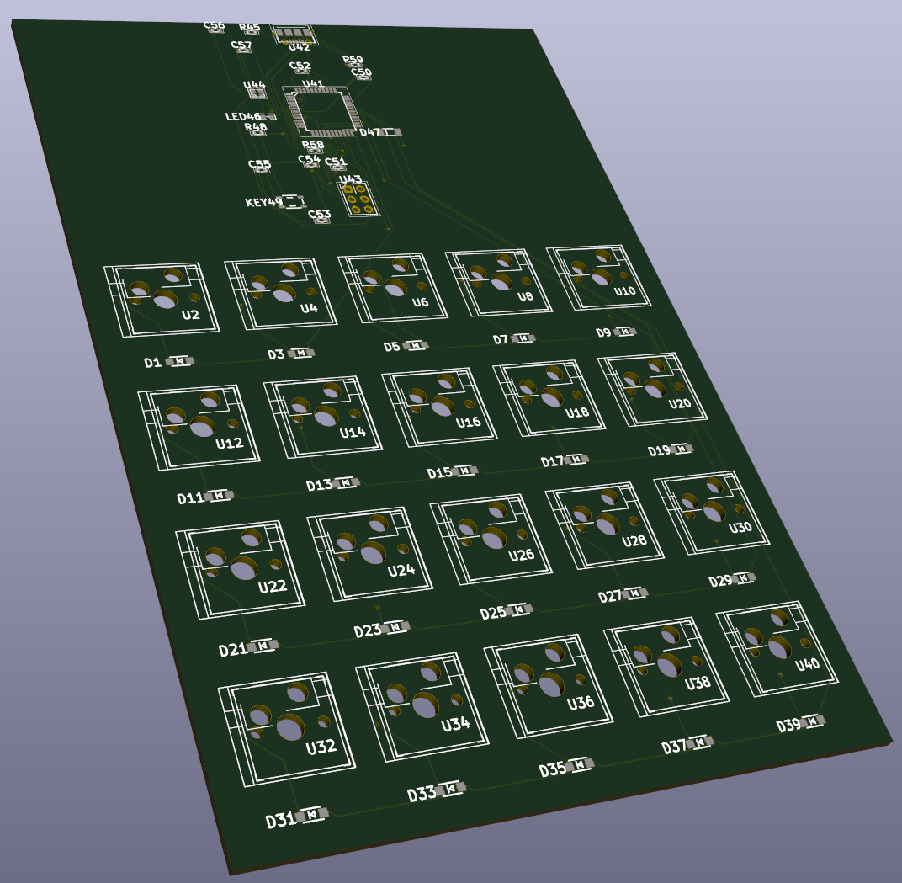
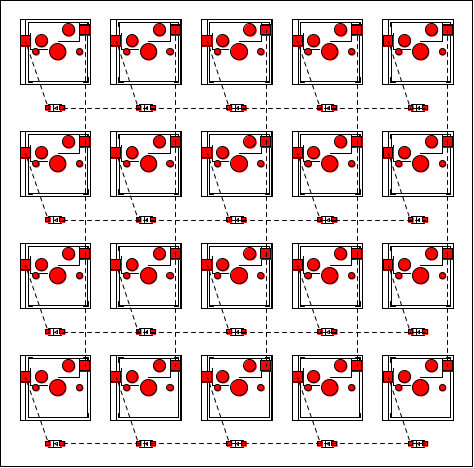
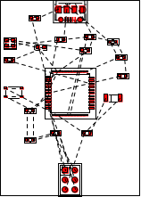
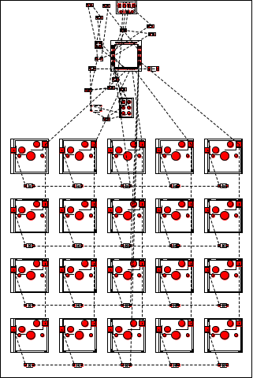

# BHDL Getting Started Guide


The programming with BHDL consists of several steps:
1. Component Selection. The information needed are:
    1. the Pin definition of the IC
    2. specify the desired footprint
2. Use `make-circuit` API to compose your circuit. Optionally, hierarchical compose your more complex circuit using `make-circuit`. Each `make-circuit` API expects several components:
    1. what the external pins are
    2. connect the components using the 4 types of connection syntax
    3. specify physical layout of components
   
3. Expose your design via `circuit-export` API, to KiCAD, PDF, BOM, etc.

In this guide, we will go over these steps using a simple keyboard example. We will assume you have a jupyter notebook opened with IRacket kernel. Please refer to the setup documents if you need to setup one, or use our online server.



## Setting up

The first step is to use the BHDL library via:

```scheme
(putenv "BHDL_LIBRARY_PATH" "~/bhdl/bhdl-footprints")
(require bhdl)
```

Note that you must setup `BHDL_LIBRARY_PATH` ENV variable to your footprint path before requiring the BHDL library.

We probably also need some racket libraries:

```scheme
(require racket/list
         racket/format
         (prefix-in pict: pict))
```

We'll want to add some global signals to refer:

```scheme
(define global
  (make-circuit
   #:external-pins (GND 3V3 5V VCC USB5V)))
```

## The keyboard matrix
The components:
- Kailh hot-swap socket: `kailh-socket`
- Diodes: `1N4148W`

```scheme
(define (key-with-diode)
  (make-circuit 
   #:external-pins (left right)
   #:vars ([d (1N4148W)]
           [key (kailh-socket 1)])
   #:connect (*- self.left key d self.right)
   #:layout (vc-append key d)))
```

We can call the `key-with-diode` to create this small circuits for each key.

```scheme
(define matrix
  (for/list ([row (in-range 4)])
            (for/list ([col (in-range 5)])
                      (key-with-diode))))
```

The `matrix` variable holds 4x5 keys. We then connect them together:

```scheme
(define matrix-module
  (make-circuit 
   #:external-pins (row[4] col[5])
   ;; col in, row out
   #:connect (for*/list ([i (in-range 4)]
                        [j (in-range 5)])
                       (debug "connecting" i j)
                       (*- self.col[j]
                           (list-ref (list-ref matrix i) j)
                           self.row[i]))
   #:layout (vc-append
             (for/list ([row matrix])
                      (hc-append row ..)
                      ) ..)))
```

We note several points here:
- We don't use ``#:vars` to create components, because we are using the `matrix` variable that is already created
- We specify 4+5 external pins for rows and columns, respectively
- We use a loop to connect the external row and column pins to the corresponding key in the matrix.
- Finally, we specify the layout to be *horizontally append" (via `hc-append` API) to form the rows  and "vertically append" (via `vc-append` API) to form the columns.

The end result of the key matrix module looks like this:




## The MCU board
The components:
- Atmega32U4
- Micro USB connector
- 16MHz Crystal
- Resistors, Capacitors, LEDs will be created "inline"

The variables, external pins and layout looks like this:

```scheme
(define mcu-module 
  (make-circuit
   #:vars ([mcu (ATmega32U4 #:FP "TQFP-44")]
           [usb (USB-Micro)]
           [icsp (icsp-header)]
           [xtal (Crystal-4 '16MHz)])
   #:external-pins (row[4] col[5])
   #:layout (vc-append 50 (rotate usb pi) mcu icsp)
   #:layout ...))
```

Some notes about this code snippets:
- `#:vars` section: We create several "big components" in the `#:vars` declaration, including the MCU, USB connector, ICSP header and crystal, because they have multiple pins and we want a handle variable to refer to them. All other components like resistors and capacitors are created "inline", where we don't really want to give them a name.
- `#:external-pins` section: The external pin of this module is 4+5 pins for row and column scanning of the key matrix.
- `#:layout` section: We layout the USB, MCU and ICSP header to be vertically appended. We don't care much about the locations of other components such as the resistors, capacitors. They will be placed by our automatic placement engine to appropriate locations by optimizing the total wire length (formally HPWL).


There are a lot of staff going on in the connection section, and we'll describe them in small sections. First, the ICSP connector for flashing firmware:

```scheme
(define mcu-module
  (make-circuit
   ...
   #:connect (*= (mcu (MOSI SCLK MISO RESET VCC GND))
               (icsp (MOSI SCK MISO RESET VCC GND)))
   ...))
```

Then the Power module including reset and switch:

```scheme
(define mcu-module
  (make-circuit
   ...
   #:connect (*- mcu.VCC mcu.UVCC mcu.AVCC global.VCC)
   #:connect (*- mcu.GND mcu.UGND global.GND)
   #:connect (*- mcu.RESET (*< (LL4148)
                           (R '10k)) global.5V)
   #:connect (*- mcu.RESET[-1] (Switch) global.GND)
   ;; An LED for blinking
   #:connect (*- mcu.PC6 (R '1k) (LED0603 'red) global.GND)
   #:connect (*- mcu.UCAP (C '1uf) global.GND)
   #:connect (*- global.VCC (*< (C '1uf)
                          (C '100nf)
                          (C '100nf)
                          (C '100nf)
                          (C '100nf))
           global.GND)
   ...))
```

The crystal module:

```scheme
(define mcu-module
  (make-circuit
   ...
   #:connect (*- mcu.XTAL1 xtal.XIN)
   #:connect (*- xtal.XOUT mcu.XTAL2)
   #:connect (*- xtal.GND global.GND)
   #:connect (*- mcu.XTAL1 (C '22pf) global.GND)
   #:connect (*- mcu.XTAL2 (C '22pf) global.GND)
   ...
   ))
```

The USB connector:

```scheme
(define mcu-module
  (make-circuit
   ...
   #:connect (*- mcu.D+ (R 22) usb.D+)
   #:connect (*- mcu.D- (R 22) usb.D-)
   #:connect (*- mcu.VBUS usb.VBUS global.VCC)
   #:connect (*- mcu.UGND usb.GND global.GND)
   ...
   ))
```

Finally, we select some GPIO pins for row and column scanning the matrix:

```scheme
(define mcu-module
  (make-circuit
   ...
   #:connect (*= (self row [0 3])
                 (self row [0 3])
                 (mcu [PB0 PB4 PB5 PB6]))
   #:connect (*= (self col [0 4])
                 (mcu [PD0 PD1 PD2 PD3 PD4]))
   ...
   ))
```

The end result would looks like this:



## Connecting the MCU module and Matrix Module


This is simply:

```scheme
(define keyboard (make-circuit
 #:connect (*= (mcu-module row [0 3])
               (matrix-module row [0 3]))
 #:connect (*= (mcu-module col [0 4])
               (matrix-module col [0 4]))
 #:layout (vc-append mcu-module matrix-module)
                  ))
```

And we export the keyboard to KiCAD, PNG, BOM:


```scheme
(parameterize ([current-directory "./out/demo-board/keyboard"]
                 [padding-general 2])
                (circuit-export keyboard 
                                #:auto-place #t
                                #:formats '(kicad pdf png bom)))
```

The keyboard looks like this:




The BOM.csv contains the mapping from the annotations (e.g. U1, R4, D3) to the component name, footprint, and value.

**Annotation**|** Name**|** Footprint**|** Values**
:-----:|:-----:|:-----:|:-----:
U36|kailh-socket|1|()
D37|1N4148W|#f|()
U38|kailh-socket|1|()
D39|1N4148W|#f|()
U40|kailh-socket|1|()
U41|ATmega16U4/ATmega32U4|TQFP-44|()
U42|USB-Micro|#f|()
U43|PinHeader2|3|()
U44|Crystal-4|#f|(16MHz)
R45|Resistor/R|0603|(1k)
LED46|LED0603|#f|(red)
D47|LL4148|#f|()
R48|Resistor/R|0603|(10k)
KEY49|SKRPACE010|#f|()
C50|Capacitor/C|#f|(1uf)
C51|Capacitor/C|#f|(1uf)
C52|Capacitor/C|#f|(100nf)
C53|Capacitor/C|#f|(100nf)
C54|Capacitor/C|#f|(100nf)
C55|Capacitor/C|#f|(100nf)
C56|Capacitor/C|#f|(22pf)
C57|Capacitor/C|#f|(22pf)
R58|Resistor/R|0603|(22)
R59|Resistor/R|0603|(22)

The `.kicad_pcb` file can be opened by the popular open source PCB EDA software KiCAD. The routing can be done by the open source freerouting software automatically. The end board is manufacture-ready, and looks like this in KiCAD's 3D-viewer:


